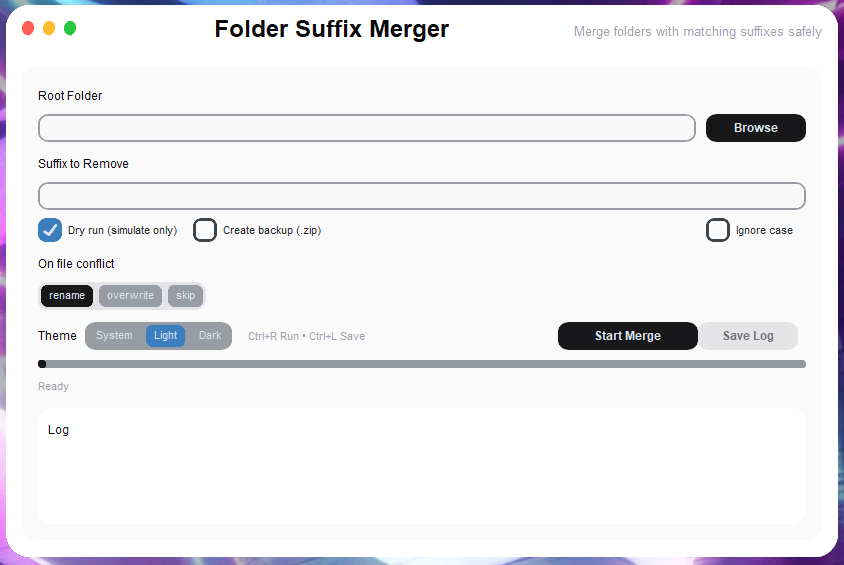

<div align="center">

# 📁 Folder Suffix Merger

**A modern, elegant tool for merging folders with matching suffixes**

[](https://python.org)
[](LICENSE)
[]()



</div>

---

## ✨ What is this?

**Folder Suffix Merger** helps you clean up messy folder structures by automatically merging folders that share the same base name but have different suffixes.

### The Problem
You have folders like this:<br>
📁 Projects/<br>
📁 MyApp/<br>
📁 MyApp_backup/<br>
📁 MyApp_old/<br>
📁 Documents/<br>
📁 Documents_copy/<br>


### The Solution
This tool merges them automatically:<br>
📁 Projects/<br>
📁 MyApp/ ← Contains files from MyApp_backup & MyApp_old<br>
📁 Documents/ ← Contains files from Documents_copy<br>


---

## 🚀 Features

| Feature | Description |
|---------|-------------|
| **🔍 Smart Detection** | Automatically finds folders with matching suffixes |
| **🧪 Dry Run Mode** | Preview changes before applying them |
| **💾 Auto Backup** | Create ZIP backup before any modifications |
| **⚡ Conflict Handling** | Choose how to handle file name conflicts |
| **🎨 Modern UI** | Clean, macOS-inspired interface with smooth animations |
| **🌓 Theme Support** | Light, Dark, and System theme options |
| **📋 Detailed Logs** | Full operation logs with export capability |

---

## 📦 Installation

### Option 1: Run Directly (Recommended)

```bash
git clone https://github.com/yourusername/folder-suffix-merger.git
cd folder-suffix-merger
python main.py

```
### Option 2 Manual Installation
```
pip install customtkinter
python main.py
```
🎯 Usage<br>
Quick Start<br>
Select Folder — Choose the root folder containing your messy structure<br>
Enter Suffix — Type the suffix to match (e.g., _backup, _old, _copy)<br>
Configure Options — Enable dry run, backup, or other settings<br>
Start Merge — Click "Start Merge" and watch it work!<br>
Conflict Resolution Modes<br>
Mode	Behavior<br>
Rename	Creates unique names for conflicting files (e.g., file (1).txt)<br>
Overwrite	Replaces existing files with source files<br>
Skip	Keeps existing files, ignores source files<br>
Keyboard Shortcuts<br>
Shortcut	Action<br>
Ctrl+R	Start merge operation<br>
Ctrl+L	Save log to file<br>


